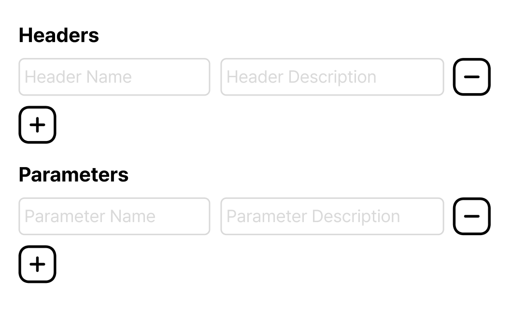
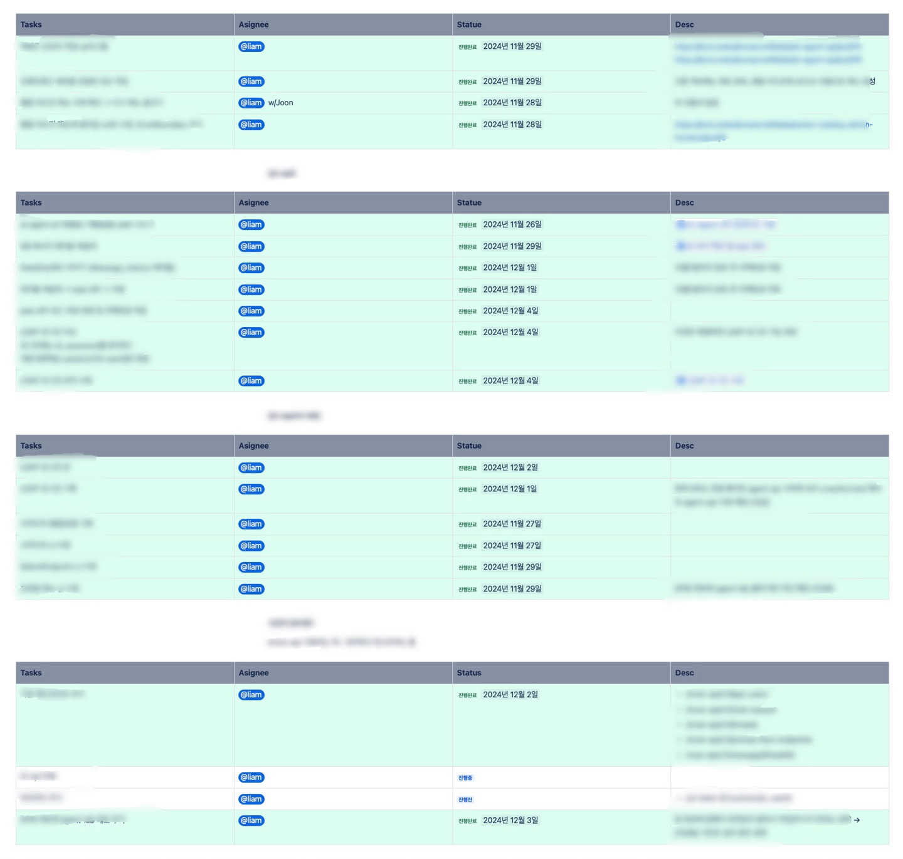

## 첫 발자국
지난주 화요일, 약 3개월간 근무했던 KCD에서 마지막 근무를 마치고 퇴사하게 되었습니다. KCD는 저의 첫 회사이자 직장 생활의 시작을 함께한 곳으로, 이곳에서 끊임없이 배우고 성장할 수 있었습니다.

짧다면 짧고 길다면 긴 지난 3개월간의 시간을 돌아보며, 회사에서의 경험과 느꼈던 점들을 회고해 보려고 합니다. 글이 다소 부족하거나 어수선할 수 있지만, 너그럽게 봐주시면 감사하겠습니다. 🙇‍♂️

## 1개월
입사 후 첫 한 달은 회사에 적응하는 데 집중했던 것 같습니다. 그중에서도 가장 어려웠던 점은 업무를 진행하기 위해 기안을 작성하는 일과 내부망과 외부망을 구분하는 일이었습니다.

회사가 MyData 사업자이다 보니 보안에 매우 민감했는데요, 업무를 수행하려면 반드시 방화벽 기안을 작성해 승인을 받아야 했습니다. 
또한, 운영 환경과 관련된 모든 작업은 내부망을 통해서만 진행할 수 있었습니다.

처음 기안을 작성할 때는 "이렇게 작성하는 게 맞을까?"라는 생각에 긴장했던 기억이 납니다. 하지만, 한 달 정도 업무를 하면서 필요한 기안을 올리다보니 어느새 기안을 올리는 것도 
익숙해졌습니다. (한 번은 기안을 잘못 작성해 승인을 받아버리는 바람에 아찔한 순간을 겪기도 했습니다. 😮‍💨)

제가 입사 후 처음 맡았던 업무는 AI 비서 관련 프로젝트였습니다. 이를 위해 AI Agent PromptFlow와 연계된 여러 작업을 진행했는데요, 첫 번째로 맡은 프로젝트는 각 부서별로 
시나리오(Endpoint, API 등)를 등록하고 관리할 수 있는 백오피스 프론트엔드 개발이었습니다. 프로젝트 초기에는 디자인 시안 없이 환경을 세팅하고 뼈대를 구축해야 했기 때문에,
UI를 어떤 방식으로 구성해야 할지 많은 고민이 있었습니다. 하지만 회사에서 사용되고 있는 백오피스들을 참고하며 UI 구성을 점차 완성할 수 있었습니다. 

## 2개월
UI와 기능 작업을 끝내고 코드 리뷰를 받으면서 백엔드와 연동을 시작했습니다. API와 연동하는 작업에선 TanStack React Query에 대해 공부한것 이외에는 큰 문제가 없었지만
카탈로그(시나리오)를 등록하는 Form을 만드면서 객체 구조 설계와 관련해 깊이 고민한 부분이 있었습니다. 이에 대해 간단히 공유드리겠습니다.

우선, 카탈로그가 어떻게 등록이 되는지 알려드리겠습니다. 

카탈로그를 등록하는 Form은 React Hook Form과 react-hook-form의 Controller를 사용하여 필드별로 상태를 관리합니다. 이를 통해 효율적으로 Form 데이터를 다룰 수 있었습니다.
Form은 아래와 같은 구조로 구성되어 있습니다:

- **Domain**, **Action**, **Endpoint**: 텍스트 입력 필드
- **Functions**: 다중 입력이 필요한 Header와 Parameter 설정
- **Description** 및 **Example 질문/답변**: 추가적인 텍스트 필드

Form 설계에서 가장 큰 고민은 Headers와 Parameters를 추가하는 방식이었습니다. 객체는 본질적으로 순서를 보장하지 않기 때문에, 
사용자가 입력한 순서를 유지하면서 데이터를 처리해야 했습니다.

이를 해결하기 위해 각 Header와 Parameter 객체에 고유한 id를 부여하여 입력 순서를 관리했습니다. 아래는 구현 방식의 간단한 설명입니다:

Header 및 Parameter 추가 시, **Date.now()** 와 **Math.random()** 을 조합하여 고유 id를 생성 후,
React Hook Form의 watch와 setValue 메서드를 사용하여 동적으로 상태 업데이트
이와 같은 방식으로 구현하여 순서를 보장하며, 데이터를 유연하게 처리할 수 있었습니다.

백오피스 프론트엔드를 완성한 후, 방화벽 승인을 기다리는 동안 기존 **Kotlin** 과 **Spring** 기반의 백엔드를 리팩토링하며, 대화 내용을 저장하는 테이블을 재설계하고 
내부에서 쓰는 API와 외부에서 쓰는 API를 나누고 내부에서 쓸 API를 추가로 구현했습니다.

업무를 체계적으로 관리하기 위해 **Task 단위** 로 업무를 나누어 진행했습니다.

또한, 내부 테스트용 **AI Agent Lab**의 UI/UX를 개선하고, LDAP 로그인 기능을 추가하며 백엔드와의 연동 작업을 완료했습니다.

## 3개월
백오피스 프론트엔드를 개발환경과 운영환경 통합 어드민 메뉴에 등록을 하고 실제 운영 중 발생할 수 있는 문제를 점검하며 프로젝트를 마무리했습니다. 

마지막으로, AI Agent PromptFlow와 연계된 작업들도 테스트 및 완료하면서 제가 맡았던 업무가 성공적으로 마무리하게 되었습니다. 🙇‍♂️

## 마무리하며
KCD에서의 3개월은 저에게 도전과 배움의 연속이었습니다. 처음 직장 생활을 시작하며 새로운 환경에 적응하는 과정은 쉽지 않았지만, 다양한 업무와 프로젝트를 경험하며 자신감을 얻게 되었습니다.

### 배운 점
- **팀워크와 커뮤니케이션** : 업무를 진행하면서 동료들과 협업의 중요성을 배웠고, 효율적인 소통이 업무의 질과 속도를 크게 향상시킨다는 것을 깨달았습니다.
- **기술적 성장** : React 기반의 백오피스 프론트엔드, Spring과 Kotlin을 활용한 백엔드 작업을 통해 최신 기술에 대한 이해를 넓힐 수 있었습니다. 
특히 코드 리뷰를 통해 프론트엔드 개발에서 더욱 깊이 있는 코드를 작성하는 법과 효율적인 코드 구조 설계 방법을 배울 수 있었습니다.
- **문제 해결 능력** : 예상치 못한 문제를 해결하기 위해 깊이 고민하고 창의적인 해결책을 찾는 연습을 많이 했습니다.
### 느낀 점
- 시간은 한정적이지만, 그 안에서 얼마나 성장할 수 있을지는 스스로에게 달려 있다는 것을 느꼈습니다.
- 처음에는 실수가 두려웠지만, 결국 실수를 통해 더 큰 교훈을 얻을 수 있었습니다. (너무 많이는 안됨.. 🤦‍♂️)
- 짧다면 짧고 길다면 긴 시간이었지만, 다양한 경험을 통해 업무의 큰 그림을 보는 법을 배웠습니다.

### 앞으로의 계획
KCD에서의 경험을 바탕으로 더 큰 도전과 성장을 이루고 싶습니다. 특히, 기술적인 깊이를 더하고 싶은 욕심이 생겼고, 앞으로는 특정 기술 스택에 대해 더 깊이 파고들 계획입니다.
또한, 협업 능력을 한 단계 더 발전시키기 위해 팀워크와 리더십에 대한 공부도 병행하려 합니다.

제게 큰 의미를 준 KCD에서의 3개월, 앞으로도 KCD에서의 경험을 바탕으로 꾸준히 나아가고자 합니다.
읽어주셔서 감사합니다. 😊